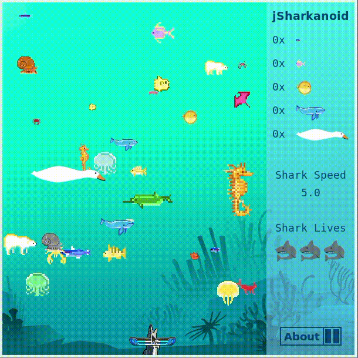

# [jSharkanoid](https://jSharkanoid.firebaseapp.com)

A clone of classic arcade game Arkanoid written in javascript and shark themed. There are block-shaped sea life in the ocean that the user must consume by sending a shark at them. The shark ricochets on blocks, the top, left, and right sides of the screen, and a launchpad at the bottom of the screen, and the goal is to consume all sea life without running out of lives.

## Architecture and Technologies
 * `Javascript` for game logic
 * `webpack` to bundle js files



## Technical Challenges
The game features a variety of object collision and rotational calculations that needed to be defined in relation to the flipped y-axis of html. Each problem required testing and verification by hand calculations in addition to testing in the actual implementation. Sometimes, the calculations did not quite fit the game well, and adjustments had to be made, including the use of corner collision and launchpad friction to change the angle of the shark in order to make the game more dynamic.

## Features
 - A variety of sea life is generated on each level, with many taking more than one bite to consume
 - The shark loses a life if it misses the launchpad and reaches the bottom of the screen
 - The shark will regenerate lives after consuming enough sea life
 - Game stats are shown on a sidebar to the right of the game area
 - The game can be paused or resumed by clicking on a button in the sidebar
 - Game sounds for background music and shark bites are included

## Upcoming Features
 - Implement more complex maps, including the use of invulnerable sea life blocks
 - Implement power up drops as a result of random consume chance or as drops that fall by random chance

## Code Implementation

While different collision checks were implemented in each individual object that the shark collides with, the angle calculations were all determined from the shark file. Here, the two more notabel collision cases are 'corner' and 'launchpad', which both have special rules on how to determine the next angle of the shark.

```javascript
// shark.js
calcAngle(option, params) {
  if (option === 'vel x mirror') {
    if (this.vel.y < 0) this.setAngle(540 - this.angle);
    else if (this.vel.y === 0) this.setAngle(this.angle + (Math.random() * 10 - 5));
    else if (this.vel.y > 0) this.setAngle(180 - this.angle);
  } else if (option === 'vel y mirror') {
    this.setAngle(360 - this.angle);
  } else if (option === 'corner') {
    let vector = {x: params.x - this.pos.x, y: params.y - this.pos.y};
    let vectorAngle = Math.atan(vector.y / vector.x) * 180 / Math.PI;
    let tangentAngle = vectorAngle + 90;
    let newAngle = 360 - (this.angle - tangentAngle) + tangentAngle;
    while (newAngle > 360) newAngle -= 360;
    this.setAngle(newAngle);
  } else if (option === 'launchpad') {
    let newVel = {x: this.vel.x + (params.vel * params.friction), y: this.vel.y}
    if (newVel.x === 0) newVel.x += [-1, 1][Math.floor(Math.random() * 2)];
    let newAngle = Math.atan(newVel.y / newVel.x) * 180 / Math.PI;
    if ((newVel.x < 0 && newVel.y > 1) || (newVel.x < 0 && newVel.y < 0)) {
      newAngle += 180;
    } else if (newVel.x > 1 && newVel.y < 1) {
      newAngle += 360;
    }
    this.setAngle(newAngle);
    this.calcAngle('vel y mirror');
  }
}
```

A case that required some testing was the position of the shark in its own local coordinates. This was used to determine its location when drawing it in canvas, as the canvas needed to be rotated before drawing the shark image in order to handle image rotation.

```javascript
// shark.js
localPos() { // Calculate position in shark local coordinates
  let cosAngle = Math.cos(Math.PI * this.angle / 180);
  let sinAngle = Math.sin(Math.PI * this.angle / 180);
  return {
    x: this.pos.x * cosAngle + this.pos.y * sinAngle,
    y: this.pos.y * cosAngle - this.pos.x * sinAngle
  }
}
```

Thank you for playing jSharkanoid!
